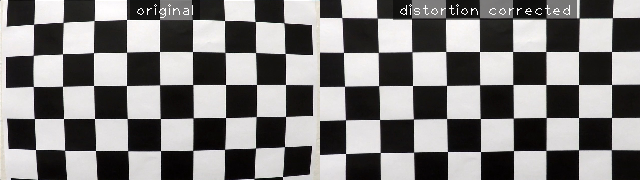
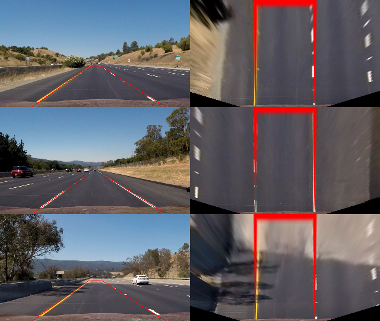
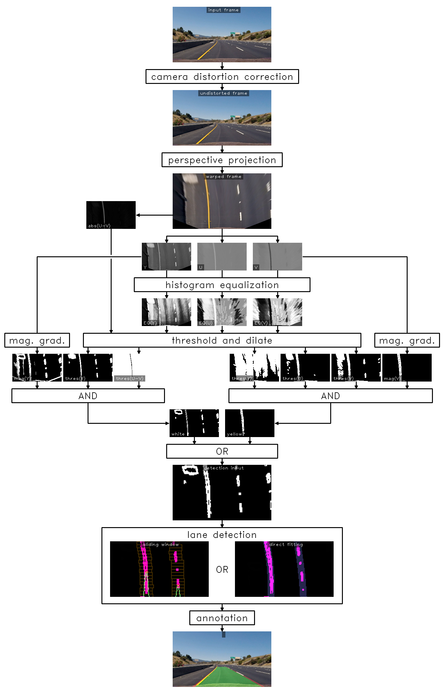
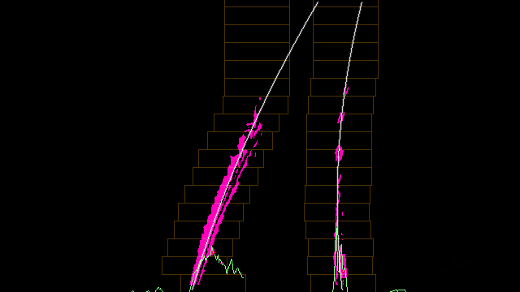
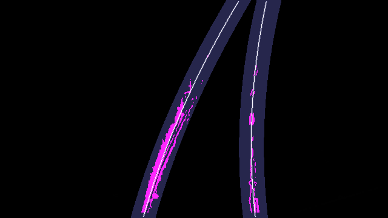
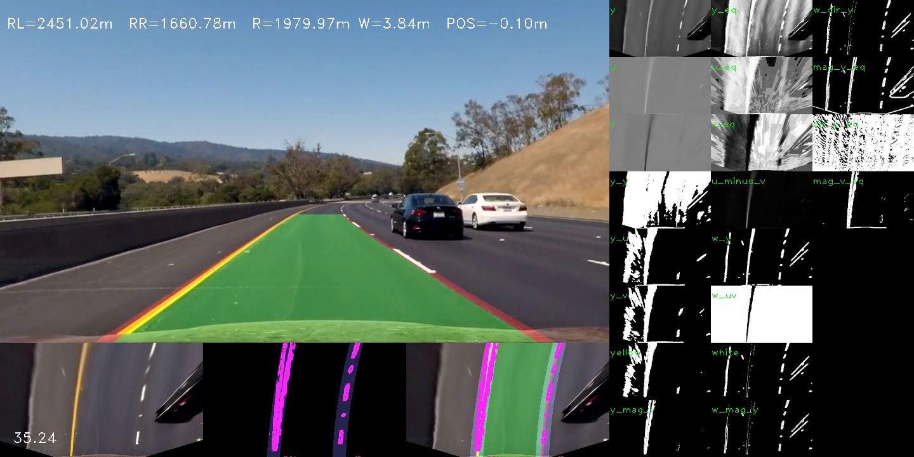
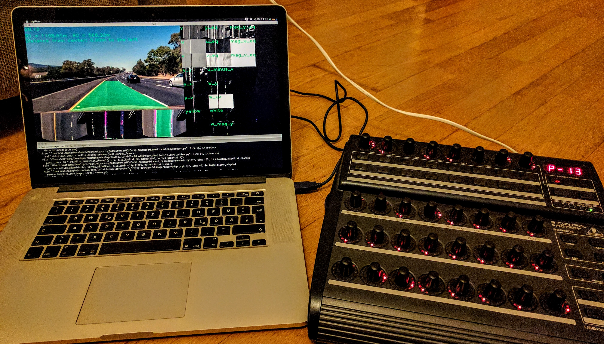

## Advanced Lane Finding

### Introduction


### 1. Camera Calibration
The code for the calculation of the distortion matrix of the camera can be found in ```camera_calibration.py```. When loading this module, it checks if camera calibration data is present in ```camera_calibration.pickle```. If the calibration has not yet been calculated, the calibration images in the ```camera_cal``` directory are analyzed to derive the ```camera_matrix```
and the ```distortion_coefficients```.

This code can be found in lines 9-41. It first uses ```cv2.findChessboardCorners``` to detect
chessboard corners in the calibration images and ```cv2.calibrateCamera``` to
calculate the distortion coefficients and the camera matrix.
The calibration data is then saved as a pickle for future use.
An example of an undistorted image can be seen below:



### 2. Perspective Transform:
In order to calculate the transformation matrix for the perspective transform
I first measured the coordinates of four corner points of a straight lane.
I chose the following coordinates:

| Source        | Destination   |
|:-------------:|:-------------:|
| 595, 450      | 440, 0        |
| 690, 450      | 840, 0        |
| 216, 720      | 440, 720      |
| 1115, 720     | 840, 720      |

The code for the perspective transform can be found in ```perspective_transform.py```. Here, the source and destination points are
used to calculate the transformation matrix M with the function ```cv2.getPerspectiveTransform```. The undistorted input image is then
transformed into a bird's eye view by a call to ```cv2.warpPerspective```. Some example images for the perspective transform are shown below:



### 3. Computation of a Binary Mask to Identify Lane Line Pixels:
Pleas refer to the following block diagram of the processing pipeline for
the different steps taken to derive a binary image for the lane line detection. All of the images shown in the block diagram can also be found in the ```output_images``` directory.



As described above, the input image is first undistorted and transformed into a bird's eye view. In order to improve performance of the system the image may then be scaled down (not shown). The scaling factor (a power of two) can be chosen freely from the command line of ```detect_lane.py```. Down-scaling
factors between 1 and 8 have successfully tested and a factor of 4 is used
as a speed/quality compromise in the result videos linked below.

The code of the following steps is contained in the class ```YUVPipline``` in the module ```FilterPipeline.py```. The bird's eye image is transformed into the YUV color space and the channels Y, U, V are contrast enhanced by histogram equalization. Equalization allows for more robust detection of the
white and yellow lanes for different lighting conditions.

In order to create a mask for the white lane lines, the following masks are combined by a logical AND function:
* Thresholding and dilation of the equalized Y channel.
* Thresholding and dilation of the absolute difference of the raw U and V channels.
* Thresholding of the magnitude of the gradient of the non-equalized Y channel.

The thresholded color sub-mask are dilated by a 3x3 kernel in order to achieve a stronger response when combined with the gradient magnitude.

A similar procedure is followed for creating a yellow mask:
* Thresholding and dilation of the equalized Y channel.
* Thresholding and dilation of the equalized U channel.
* Thresholding and dilation of the equalized V channel.
* Thresholding of the magnitude of the gradient of the non-equalized V channel.

The result of these operations are then combined by a bitwise OR into the resulting binary input for lane line detection.


### 4. Lane Line Detection and Polynomial Fitting
The lane line detection and polynomial fitting is handeled by the class ```LaneLine``` defined in ```LaneLine.py```. The class ```LaneDetector``` defined in ```LaneDetector.py``` holds two instances of the ```LaneLine``` class for the left and right lane lines. Each instance has an anchor point that is set to the lower left/right destination coordinates of the perspective transform. Lane detection and fitting is coordinated by the method ```LaneLine.fit_laen_line```.

The first detection is achieved using a sliding window algorithm (method ```LaneLine.perform_sliding_window``` called from ```LaneLine.detect_with_sliding_window```): Starting from the anchor point,  a histogram of a window centered around the anchor point and extending upward to the center of the input frame is computed. The x-coordinate of the highest peak of this histogram is then selected as a starting point for the sliding window algorithm.

All the non-zero pixels of the binary input mask that are contained in the current window are added into a growing list of coordinates. The window is successively moved upwards and is moved sideways by the distance between its center and the computed mean of the contained pixels. This allows the window to follow the curvature of the lane line.



After a pass of the window through the image, the collection of encountered positive pixel coordinates is used to fit a second order polynomial (function ```lanemath.fit_quadratic``` called from method ```LaneLine.detect_with_sliding_window```). Every time a fit for the lane line is found and it does not deviate too much from the current best fit (determined by ```LaneLine.is_current_fit_good```) the best fit is updated. This is done by use of a simple low-pass filtering algorithm (```LaneLine.do_update_polynomial```).

When the next frame is processed and a previous "best fit" is present, the sliding window algorithm is bypassed in favor for direct polynomial fitting. This has two advantages: direct fitting is significantly faster and it increases the resilience of the algorithm as the image is searched selectively in the vicinity where the line was present in the last frame.

This algorithm uses the current best fit to select non-zero pixels inside of a certain margin ```LaneLine.fit_margin``` around the interpolated coordinates of the current polynomial. These coordinates are then used to fit a new polynomial directly.




### 5. Calculating Radius of Curvature and Position in Lane
The polynomial fit at this point in time is defined in pixel coordinates with the y-axis starting at the bottom of the image pointing upwards (from the position of the car). The polynomial coefficients have to be converted into real-world values in meters in order to compute the radius of curvature.
For this the conversion constants ```xm_per_px``` and ```ym_per_pixel``` have been defined. With these the three polynomial coefficients can be converted (x_p = A_p * y_p**2 + B_p * y_p + C_p):

| Pixel space   | Real-World    |
|:-------------:|:-------------:|
|     A_p       |  A_m = A_p * xm_per_px / ym_per_pixel**2 |
|     B_p       |  B_m = B_p * xm_per_px / ym_per_pixel    |
|     C_p       |  C_m = C_p * xm_per_px |

These conversion constants are stored in the member variable ```LaneLine.pconv``` and can be simply multiplied with the ```current_fit``` in order to get the corresponding coefficients in meters.

The Radius of curvature is then computed with the formula (see ```lanemath.calc_radius```):

``` R = (1 + (2*A*y + B)**2)**1.5 / max(1e-5, abs(2*A)) ```

The radius is computed nearest to the car which corresponds to a y-coordinate of ```y = 0```.

The position of the car relative to the center of the lane is computed in ```LaneDetector.calc_distance_from_center```, together with an estimate of the lane width. First the distance of each ```LaneLine``` from the center of the car is computed in ```LaneLine.calc_distance_from_center```:

```d_lane = (C_p - image_width / 2) * xm_per_px```

From this, the width of the lane is computed:

``` w_lane = d_lane_right - d__lane_left ```

And, finally, the distance of the car from the center of the lane as:

```d = w_lane / 2 - d_lane_right```

### 6. Annotated Example Output Image
An example annotated output image is shown below together with the output of
the different stages of the pipeline.



### 7. Annotated Videos
Project video:
https://youtu.be/mmcm7UMOJ7M

Project video with diagnostics:
https://youtu.be/uLbQonY8yCk

Challenge video with diagnostics:
https://youtu.be/YmyYGWXd-r0


### 8. Discussion
This project was surprisingly difficult and time consuming. The filter pipeline has many parameters that have to be optimized which was at first very time consuming. Very helpful for me was to display all of the intermediate steps in the pipeline in an interactive run of the lane detection algorithm. This was possible because of downscaling of the detection input, which increased the frame rate to about one quarter to one half of the original video frame rate.

In order to optimize the multitude of filters in real time, I used a MIDI controller as shown below which allowed for the adjusting of many parameters
simultaneously. This greatly reduced the time of iteration during development.

The pipeline will likely fail in many situations, including:

* Rapid changes of lighting.
* Changes of the color hues due to solar altitude.
* Adverse weather (rain, snow).
* Different lighting at night (including headlight dazzle).
* Sharp turns.

As much time as I have invested in this project, I feel like barely having scraped the surface of what would be required to have a robust system. Some improvements could be:

* Using a dynamic equalization of the windows during the sliding windows in order to mitigate stark differences in lighting.
* Moving the sliding window in the x-direction for very sharp turns.
* Utilizing the direction of the gradient to better filter out non-lane features in the image. (I tried this but did not complete due to time constraints.)
* Developing better criteria to differentiate between good and bad fits.
* Keeping track of the center of the lane as an interpolated polynomial and use this as a foundation for lane-finding.
* Imposing the polynomial of the better fitted lane line onto the worse one.




Briefly discuss any problems / issues you faced in your implementation of this project. Where will your pipeline likely fail? What could you do to make it more robust?
