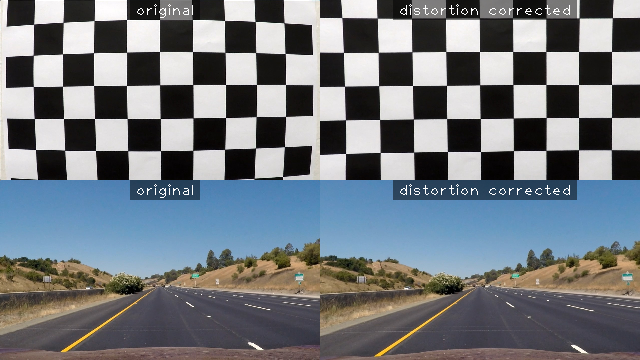

## Advanced Lane Finding - Wolfgang Steiner <wolfgang.steiner@gmail.com>

### Introduction


### 1. Camera Calibration
The code for the calculation of the distortion matrix of the camera can be found in ```camera_calibration.py```. When loading this module, it checks if camera calibration data is present in ```camera_calibration.pickle```. If the calibration has not yet been calculated, the calibration images in the ```camera_cal``` directory are analyzed to derive the ```camera_matrix```
and the ```distortion_coefficients```.

This code can be found in lines 9-41. It first uses ```cv2.findChessboardCorners``` to detect
chessboard corners in the calibration images and ```cv2.calibrateCamera``` to
calculate the distortion coefficients and the camera matrix.
The calibration data is then saved as a pickle for future use.
An example of an undistorted image can be seen below:



### 2. Perspective Transform:
In order to calculate the transformation matrix for the perspective transform
I first measured the coordinates of four corner points of a straight lane.
I chose the following coordinates:

| Source        | Destination   |
|:-------------:|:-------------:|
| 595, 450      | 440, 0        |
| 690, 450      | 840, 0        |
| 216, 720      | 440, 720      |
| 1115, 720     | 840, 720      |

The code for the perspective transform can be found in ```perspective_transform.py```. Here, the source and destination points are
used to calculate the transformation matrix M with the function ```cv2.getPerspectiveTransform```. The undistorted input image is then
transformed into a bird's eye view by a call to ```cv2.warpPerspective```. Some example images for the perspective transform are shown below:


### 3. Computation of a Binary Mask to Identify Lane Line Pixels:
Pleas refer to the following block diagram of the processing pipeline for
the different steps taken to derive a binary image for the lane line detection:


As described above, the input image is first undistorted and transformed into a bird's eye view. In order to improve performance of the system the image may then be scaled down (not shown). The scaling factor (a power of two) can be chosen freely from the command line of ```detect_lane.py```. Down-scaling
factors between 1 and 8 have successfully tested and a factor of 4 is used
as a speed/quality compromise in the result videos linked below.

The code of the following steps is contained in the class ```YUVPipline``` in the module ```FilterPipeline.py```. The bird's eye image is transformed into the YUV color space and the channels Y, U, V are contrast enhanced by histogram equalization. Equalization allows for more robust detection of the
white and yellow lanes for different lighting conditions.

In order to create a mask for the white lane lines, the following masks are combined by a logical AND function:
* Thresholding and dilation of the equalized Y channel.
* Thresholding and dilation of the absolute difference of the raw U and V channels.
* Thresholding of the magnitude of the gradient of the non-equalized Y channel.

The thresholded color sub-mask are dilated by a 3x3 kernel in order to achieve a stronger response when combined with the gradient magnitude.

A similar procedure is followed for creating a yellow mask:
* Thresholding and dilation of the equalized Y channel.
* Thresholding and dilation of the equalized U channel.
* Thresholding and dilation of the equalized V channel.
* Thresholding of the magnitude of the gradient of the non-equalized V channel.

The result of these operations are then combined by a bitwise OR into the resulting binary input for lane line detection.


In this project, your goal is to write a software pipeline to identify the lane boundaries in a video, but the main output or product we want you to create is a detailed writeup of the project.  Check out the [writeup template](https://github.com/udacity/CarND-Advanced-Lane-Lines/blob/master/writeup_template.md) for this project and use it as a starting point for creating your own writeup.  
